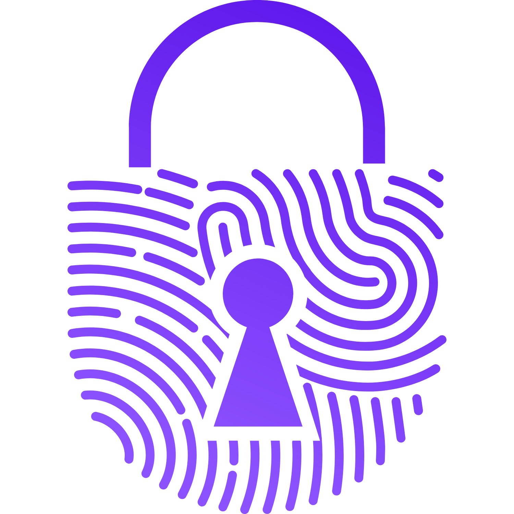

<p align="center">
  
</p>

<h1 align="center">Secure Vault - The Only Key Is You</h1>

<p align="center">
  <strong>A zero-knowledge, end-to-end encrypted password manager built with modern web technologies</strong>
</p>

<p align="center">
  <a href="#features">Features</a> •
  <a href="#architecture">Architecture</a> •
  <a href="#getting-started">Getting Started</a> •
  <a href="#development">Development</a> •
  <a href="#contributing">Contributing</a> •
  <a href="#license">License</a>
</p>

---

## 🚀 Overview

Secure Vault is a privacy-first password management solution that puts you in complete control of your digital security. Built with enterprise-grade encryption and modern web technologies, it ensures your sensitive data remains encrypted and inaccessible to anyone but you.


- **Client-side encryption**: All data is encrypted before leaving your device
- **Master password protection**: Your master password is never transmitted or stored
- **End-to-end encryption**: Data remains encrypted in transit and at rest
- **Zero-knowledge architecture**: We cannot access your passwords or sensitive information

## ✨ Key Features

- **End-to-End Encryption:** Your data is encrypted on your device and remains encrypted on our servers, ensuring only you can access it.
- **Master Password Security:** Your master password is the only key to unlocking your vault.
- **Secure Storage:** Keep all your valuable data safe and organized in one place.
- **Secure Sharing:** Share your information securely with trusted individuals.

## 🌐 User Experience
- **Internationalization (i18n)** support for multiple languages
- **Responsive design** optimized for all devices
- **Dark/Light theme** support with system preference detection
- **Modern UI/UX** built with HeroUI and Framer Motion

## Why Choose Secure Vault?

- **Ultimate Privacy:** Your data is your business. We don't have access to it.
- **Peace of Mind:** Securely store and manage your most important information.
- **Easy to Use:** A user-friendly interface makes it simple to manage your vault.
- **Open Source:** We welcome community contributions to make Secure Vault even better.

## 🔧 Technical Features
- **TypeScript** for type safety and better development experience
- **Next.js 15** with App Router and Turbopack
- **React 19** with latest features and optimizations
- **Tailwind CSS** for utility-first styling
- **Zustand** for state management
- **React Hook Form** with Zod validation

## 🏗️ Frontend Stack
- **Framework**: Next.js 15 with App Router
- **Language**: TypeScript
- **UI Library**: React 19
- **Styling**: Tailwind CSS
- **State Management**: Zustand
- **Forms**: React Hook Form + Zod
- **UI Components**: HeroUI
- **Animations**: Framer Motion
- **Internationalization**: next-intl

## 🚀 Getting Started

### Prerequisites
- **Node.js** 18+ 
- **Yarn** 4.7.0+ (recommended) or npm
- **Git**

### Installation

1. **Clone the repository**
   ```bash
   git clone https://github.com/puneetkakkar/secure-vault-web
   cd secure-vault-web
   ```

2. **Install dependencies**
   ```bash
   yarn install
   ```

3. **Set up environment variables**
   ```bash
   cp .env.example .env.local
   ```
   
   Configure the following variables:
   ```env
   NEXT_PUBLIC_API_BASE_URL=http://localhost:8080/api
   NEXT_PUBLIC_APP_URL=http://localhost:3000
   ```

4. **Start the development server**
   ```bash
   yarn dev
   ```

5. **Open your browser**
   Navigate to [http://localhost:3000](http://localhost:3000)

### Available Scripts

| Command | Description |
|---------|-------------|
| `yarn dev` | Start development server with Turbopack |
| `yarn build` | Build for production |
| `yarn start` | Start production server |
| `yarn lint` | Run ESLint |
| `yarn format` | Check code formatting |
| `yarn format:fix` | Fix code formatting |

## 🔧 Development

### Code Quality
- **ESLint** for code linting
- **Prettier** for code formatting
- **Husky** for git hooks
- **lint-staged** for pre-commit checks

### Development Workflow
1. Create a feature branch from `main`
2. Make your changes following the coding standards
3. Run tests and ensure code quality checks pass
4. Submit a pull request with a clear description

### Coding Standards
- Use TypeScript for all new code
- Follow ESLint and Prettier configurations
- Write meaningful commit messages
- Add appropriate JSDoc comments for public APIs
- Use conventional commit format

## 🌍 Internationalization

The application supports multiple languages through `next-intl`. Translation files are located in the `messages/` directory.

### Adding a New Language
1. Create a new JSON file in `messages/` (e.g., `de.json`)
2. Add the language configuration to the Next.js config
3. Update the language selector component

## 🔐 Security Considerations

### Encryption Implementation
- Uses Web Crypto API for cryptographic operations
- Implements industry-standard encryption algorithms
- Follows OWASP security guidelines
- Regular security audits and updates

### Best Practices
- Never log sensitive information
- Use HTTPS in production
- Implement proper session management
- Regular dependency updates
- Security headers configuration

## 🤝 Contributing

We welcome contributions from the community! Please read our [Contributing Guidelines](CONTRIBUTING.md) before submitting pull requests.

### How to Contribute
1. **Fork** the repository
2. **Create** a feature branch
3. **Make** your changes
4. **Test** thoroughly
5. **Submit** a pull request

### Development Setup
1. Follow the installation instructions above
2. Set up the backend server (see [secure-vault-server](https://github.com/puneetkakkar/secure-vault-server))
3. Configure environment variables
4. Run the development server

### Code of Conduct
Please read our [Code of Conduct](CODE_OF_CONDUCT.md) to keep our community approachable and respectable.

## 📄 License

This project is licensed under the MIT License - see the [LICENSE](LICENCE.md) file for details.

## 🔗 Related Projects

- **[Secure Vault Server](https://github.com/puneetkakkar/secure-vault-server)** - Spring Boot backend API
- **[Secure Vault Mobile](https://github.com/puneetkakkar/secure-vault-mobile)** - React Native mobile app (WIP)

## 📞 Support

- **Issues**: [GitHub Issues](https://github.com/puneetkakkar/secure-vault-web/issues)
- **Discussions**: [GitHub Discussions](https://github.com/puneetkakkar/secure-vault-web/discussions)
- **Security**: [Security Policy](SECURITY.md)

## 🙏 Acknowledgments

- Built with [Next.js](https://nextjs.org/)
- UI components from [HeroUI](https://heroui.com/)
- Icons from [Lucide React](https://lucide.dev/)
- Encryption based on industry standards and best practices

---

<p align="center">
  <strong>Secure your digital life with confidence</strong><br>
  <em>The only key is you.</em>
</p>
